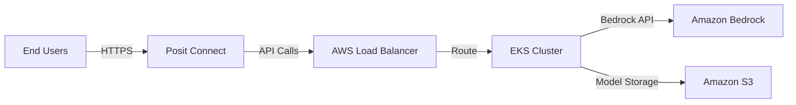

# Deployment Guide: Posit Connect & Amazon EKS

This guide explains how to deploy the Cancer Prediction System to **Posit Connect** (PyShiny Dashboard) and **Amazon EKS** (FastAPI Service).

## Architecture Overview



## Part 1: Deploy FastAPI to Amazon EKS

### Prerequisites
- EKS cluster running
- `kubectl` configured
- ECR repository created
- IAM role with Bedrock permissions

### Step 1: Build and Push Docker Image
```bash
# Authenticate to ECR
aws ecr get-login-password --region us-east-1 | docker login --username AWS --password-stdin <ACCOUNT_ID>.dkr.ecr.us-east-1.amazonaws.com

# Build image
docker build -t cancer-prediction-api .

# Tag and push
docker tag cancer-prediction-api:latest <ACCOUNT_ID>.dkr.ecr.us-east-1.amazonaws.com/cancer-prediction-api:latest
docker push <ACCOUNT_ID>.dkr.ecr.us-east-1.amazonaws.com/cancer-prediction-api:latest
```

### Step 2: Update Kubernetes Manifests
Edit `k8s/deployment.yaml`:
- Replace `<YOUR_ECR_REPO>` with your ECR repository URL
- Replace `<ACCOUNT_ID>` with your AWS account ID

### Step 3: Deploy to EKS
```bash
kubectl apply -f k8s/deployment.yaml
```

### Step 4: Get Service URL
```bash
kubectl get svc cancer-prediction-service
# Note the EXTERNAL-IP (Load Balancer URL)
```

## Part 2: Deploy PyShiny Dashboard to Posit Connect

### Prerequisites
- Posit Workbench installed on EKS
- Posit Connect server running
- `rsconnect-python` CLI installed

### Step 1: Install rsconnect-python
```bash
pip install rsconnect-python
```

### Step 2: Configure Posit Connect
```bash
rsconnect add \
  --server https://your-posit-connect-server.com \
  --name myserver \
  --api-key <YOUR_API_KEY>
```

### Step 3: Update Dashboard to Call EKS API
Edit `src/dashboard.py` and update the API endpoint:
```python
API_ENDPOINT = "http://<EKS_LOAD_BALANCER_URL>/predict"
```

### Step 4: Deploy to Posit Connect
```bash
rsconnect deploy shiny \
  --server myserver \
  --title "Cancer Prediction Dashboard" \
  .
```

### Step 5: Access Dashboard
Navigate to: `https://your-posit-connect-server.com/content/<app-id>/`

## Part 3: Configure IAM for Bedrock Access

### Create IAM Role
```json
{
  "Version": "2012-10-17",
  "Statement": [
    {
      "Effect": "Allow",
      "Action": [
        "bedrock:InvokeModel"
      ],
      "Resource": "arn:aws:bedrock:us-east-1::foundation-model/anthropic.claude-3-sonnet-20240229-v1:0"
    }
  ]
}
```

### Attach to EKS Service Account
```bash
eksctl create iamserviceaccount \
  --name cancer-prediction-sa \
  --namespace default \
  --cluster <YOUR_CLUSTER_NAME> \
  --attach-policy-arn arn:aws:iam::<ACCOUNT_ID>:policy/BedrockInvokePolicy \
  --approve
```

## Monitoring & Logs

### View EKS Logs
```bash
kubectl logs -l app=cancer-prediction --tail=100 -f
```

### View Posit Connect Logs
Access via Posit Connect UI: Settings → Logs

## Troubleshooting

### Dashboard Can't Reach API
- Verify EKS Load Balancer is accessible from Posit Connect
- Check security groups allow traffic on port 80

### Bedrock Permission Errors
- Verify IAM role is attached to service account
- Check IAM policy includes `bedrock:InvokeModel`
