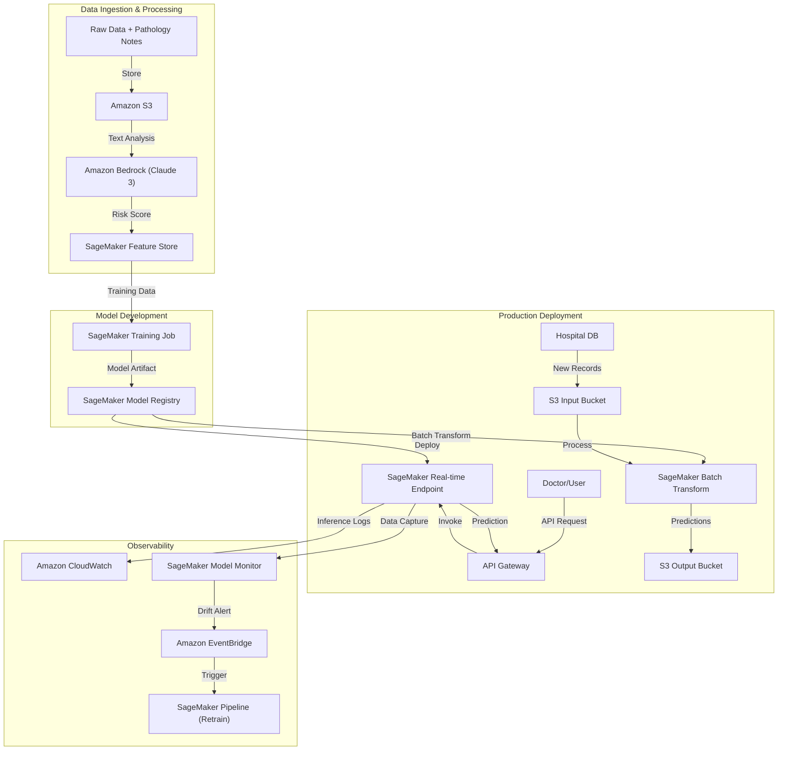

# Cancer Prediction MLOps Workflow (AWS Edition)

This document outlines the end-to-end lifecycle of the Cancer Prediction System, leveraging **AWS Cloud Services** for a robust, scalable MLOps pipeline.

## 1. Data Ingestion & Feature Engineering (AWS Bedrock)
- **Storage**: Raw patient data and pathology notes are stored in **Amazon S3**.
- **LLM Processing**: **Amazon Bedrock** (using Claude 3 Sonnet) is invoked to analyze unstructured pathology notes. It extracts a `malignancy_risk_score` (1-10).
- **Feature Store**: The combined features (numerical + LLM score) are versioned in **SageMaker Feature Store**.

## 2. Model Training (Amazon SageMaker)
- **Training**: A **SageMaker Training Job** runs the Random Forest algorithm on scalable compute instances (e.g., `ml.m5.xlarge`).
- **Registry**: Successful models are registered in the **SageMaker Model Registry**, tracking versions, metrics, and approval status (Pending -> Approved).

## 3. Deployment Modes
### A. Online Inference (SageMaker Real-time Endpoint)
- **Service**: The model is deployed to a **SageMaker Real-time Endpoint**.
- **Access**: Exposed via **Amazon API Gateway** + **AWS Lambda** (optional) to provide a secure REST API for doctors.
- **Latency**: Optimized for low-latency predictions.

### B. Batch Processing (SageMaker Batch Transform)
- **Service**: **SageMaker Batch Transform** is used for processing large datasets (e.g., nightly hospital dumps) stored in S3.
- **Throughput**: Handles GBs/TBs of data automatically.

## 4. Monitoring & Continuous Improvement
- **Drift Detection**: **SageMaker Model Monitor** continuously analyzes request/response data for **Data Drift** (e.g., changing tumor sizes) and **Concept Drift**.
- **Automated Retraining**: If drift is detected, an **EventBridge** rule triggers a **SageMaker Pipeline** to re-run data processing and training on the latest data.
